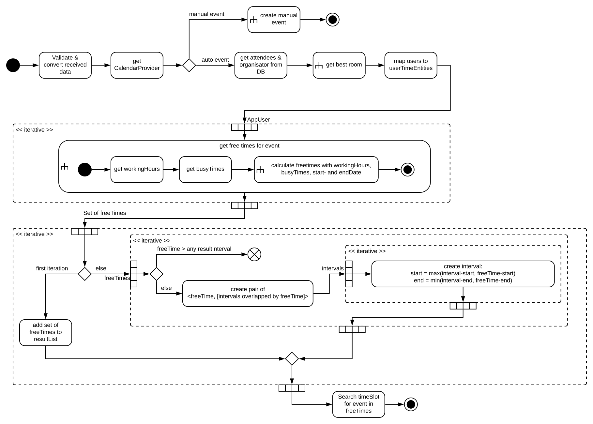
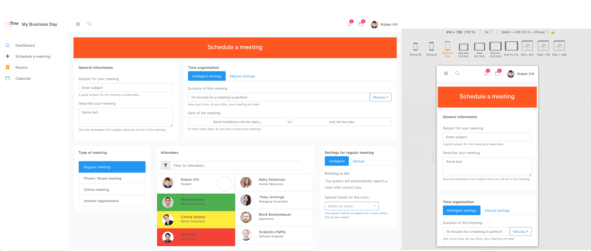
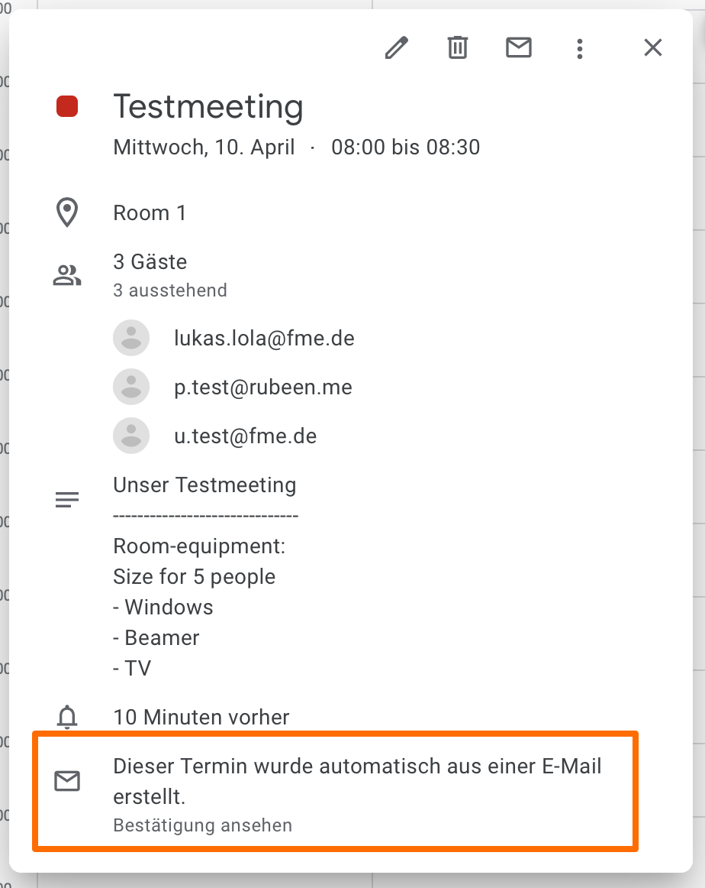

# Meine Bachelorarbeit

Im Dezember 2018 suchte ich ein Thema, das ich für meine Bachelorarbeit verwenden konnte. Dazu habe ich viele Themen im Katalog der möglichen Arbeiten für das Studium angeschaut und  mich letztendlich für die automatische Terminplanung entschieden.

Hochmotiviert arbeitete ich während meines Praxisprojektes bei der fme am Design einer solchen Anwendung. Ein Projekt der TU Braunschweig hat sich bereits mit dem Thema beschäftigt, für meine Arbeit wollte ich allerdings mehr. Ich entschloss mich, eine Umfrage zu erstellen und vor allem  von Mitarbeitern der fme  ausfüllen zu lassen ([Ergebnisse übrigens hier](https://pulse.fme.de/groups/office-braunschweig/blog/2019/02/11/results-of-the-survey-for-my-thesis)). Dabei erhielt ich über 80 Antworten, die ich für meine Bachelorarbeit aufbereitete. Daraus wiederrum konnte ich Anforderungen entwickeln, die ich später umsetzen konnte. 
Neben der Aufbereitung der Umfrage erstellte ich zudem Diagramme, Use-Cases sowie Anforderungstabellen, welche die Prozesse anschaulich machen. Ein BPMN-Beispiel (eher eine Mischung aus UML & BPMN) ist folgend dargestellt:



Nachdem ich alle Anforderungen an die Anwendung aufgestellt sowie die Grenzen klargestellt hatte, konnte ich die Anwendung realisieren. Mir war schon von Anfang an klar, dass ich eine möglichst moderne Webanwendung entwickeln möchte. Zuerst wollte ich am liebsten alles selbst schreiben und nur einige Komponenten einfügen, doch ich entschloss mich sehr schnell dazu, eine Vorlage eines Dashboards zu benutzen, welche ich im Anschluss erweitert habe an meine Bedürfnisse. Diese Vorlage half mir zudem, mich an ein bestimmtes Layout zu halten und bot sogar einige Anreize, die Anwendung intuititiver zu designen.
Bei der Auswahl der Vorlage hatte ich eine Auswahl an unglaublich vielen verschiedenen Designs, eines schöner und besser als das andere. Letzten Endes habe ich mich für das [Adminator-Dashboard](https://github.com/puikinsh/Adminator-admin-dashboard) entschieden - während und nach der Entwicklung habe ich noch über [500 bessere Konzepte](https://muz.li/inspiration/dashboard-inspiration/) gefunden.
Die ausgewählte Vorlage nutzt npm und hat bereits Konfigurationen für einen Entwicklungs-Server. In der Schule hatte ich bereits Kontakt zu HTML und CSS, das wurde im Studium weiter vertieft und durch ein wenig JavaScript erweitert (dort musste ich im letzten Semester Pong ohne Javascript-Frameworks programmieren). Zudem habe ich mir während des Teamprojekts erweiterte Javascript-Kenntnisse angeeignet,  indem ich viele Ajax-Aufrufe mit Callbacks geschrieben hatte. Doch mit npm habe ich bisher noch nie gearbeitet, nur davon gehört und es irgendwie achten gelernt. Nun musste ich mich für meine Bachelorarbeit also damit beschäftigen. Ich habe mich eingearbeitet, es am Ende zwar immernoch nicht ganz verstanden, doch irgendwie hat alles was ich wollte funktioniert. Dabei ist folgende prototypische Implementierung entstanden:




Mit dem Design war ich am Ende zufrieden, nun konnte ich damit beginnen, es mit Inhalten zu füllen und Berechnungen ausführen zu lassen - das eigentliche Thema meiner Bachelorarbeit (ich studiere im Schwerpunkt Software-Engineering, nicht Webdesign…).
Da ich jederzeit mit Jens sprechen und ihm meine verrückten Ideen vorstellen konnte, fand ein ständiger Austausch statt, ich konnte dadurch viel neues Lernen. So auch, dass ich eine Middleware nutzen sollte. Den Sinn daran, nämlich die Möglichkeit, das Frontend unabhängig vom Backend betreiben und skalieren zu können und umgekehrt, verstand ich allerdings erst später. Für die Middleware suchte ich mir, um möglichst viele Techniken kennenzulernen, die zudem modern sind, NodeJS aus. Ich hatte bisher überhaupt keine Erfahrung damit, dessen Existenz wie die von npm eher achtend hingenommen. Das hat sich während der Arbeit aber drastisch geändert, sodass ich nun am liebsten viele Projekte mit NodeJS umsetzen möchte, vielleicht sogar ein ganzes Backend. Beeindruckt hat mich zum Beispiel, mehrere Funktionen an eine URL zu registrieren, sodass eine Anfrage immer erst überprüft wird und im Anschluss mehr passiert, zum Beispiel, dass die Anfrage an eine andere URL weitergeleitet wird, wie im folgenden Codebeispiel:

```js
app.use('/api', indexRouter.apiFunction, proxy({
    target: 'https://localhost:8443',
    secure: false,
    changeOrigin: true,
    pathRewrite: {
        '^/api': '/'
    }
}));
```

Damit ist es möglich, das Backend so zu verstecken, dass nur die Middleware darauf zugreifen kann, zum Beispiel mit einem Docker-Container ist dies sogar sehr einfach machbar (dazu später mehr).

Das Codebeispiel verrät: unter localhost:8443 existiert eine weitere Anwendung - das Backend. Das Backend ist zudem an eine Datenbank angebunden, in der die Benutzer der Anwendung gespeichert sind und einige Sachen mehr. Auch kommuniziert das Backend mit externen APIs (besser wäre es natürlich über die Middleware…), zum Beispiel mit der [Google Calendar-API](https://developers.google.com/calendar/) oder der [Office(365) Kalender-API](https://docs.microsoft.com/en-us/previous-versions/office/office-365-api/api/version-2.0/calendar-rest-operations). Daraus resultiert, dass Nutzer Kalender der jeweiligen Provider an die Anwendung anbinden können. Dazu wurde ebenfalls ein UI erstellt, doch auch das Backend muss an dieser Stelle etwas tun. Ein Nutzer teilt der Anwendung nicht seinen Usernamen und das Passwort des Providers mit - sondern die Anwendung erhält einen Access-Token, den der Provider der Anwendung zur Verfügung stellt, sobald der Benutzer sich bei einem Provider anmeldet und der Anwendung das Recht gibt, auf den Account über die API zuzugreifen. Dieses Prinzip, OAuth, ist weit verbreitet und gilt als aktueller Authentifizierungsmechanismus, vor allem für APIs.

Nachdem die Anbindung der APIs realisiert wurde, das war schon ein erster kleiner Erfolg für mich und die Arbeit, konnte ich mich mit den *wichtigeren* Dingen der Arbeit beschäftigen: das Authentifizieren eines Nutzers an der Anwendung, die Registrierung, das Abrufen einer Liste von anderen Nutzern, die Berechnung von einem Terminvorschlag sowie das Erstellen eines Termins in einem Nutzerkalender - als Zusatz beschäftigte ich mich auch mit einer Raumfunktionalität (später mehr).

Zum Glück war ich im ständigen Austausch mit Jens - ohne ihn hätte ich z.B. nicht gewusst, dass Datenbankzugriffe mit Java (bzw. Spring) auch Spaß machen können, denn [jooq](https://www.jooq.org) kannte ich bis dato nicht. Jooq hat die SQL-Syntax abstrahiert (verschiedene Dialekte zusammengefasst) und in einer unvergleichlichen Weise in Java implementiert. So ist es damit möglich, folgendes zu tun:

```java
final Result<Record2<Integer, String>> fetch = databaseService.getContext()
                    .select(ROOM.ROOM_ID,
                            when(ROOM_EQUIPMENT.EQUIP_NAME.in(roomValues),
                                    ROOM_EQUIPMENT.EQUIP_NAME)
                                    .otherwise(castNull(String.class)))
                    .from(ROOM)
                    .innerJoin(ROOM_ROOM_EQUIPMENT).onKey()
                    .innerJoin(ROOM_EQUIPMENT).onKey()
                    .where(ROOM.ROOM_SIZE.greaterOrEqual(minSize))
                    .fetch();
```

Dabei werden zwei Spalten (Raum-ID, Name der Raumausstattung, wenn sie gesucht wird - sonst null) ausgewählt aus einer n:m-Beziehung, welche mithilfe von innerJoins zusammengefügt wird. Zudem werden Räume gefiltert, die mindestens eine Anzahl an Plätzen besitzen. Mit anderen Datenbank-Zugriffsmethoden (z.B. jpa) wäre eine solche Abfrage nicht so intuitiv zu realisieren gewesen. Generell ist es mit jooq möglich, Datenbankabfragen durch ausprobieren zu schreiben (nicht an der Datenbank probiert, eher mit Syntaxmeldungen der Entwicklungsumgebung) - die Art und Weise des Zugriffs ähnelt sehr der SQL-Syntax.
Ein weiterer Vorteil von jooq ist die automatische Umwandlung von SQL-Tabellen zu Java-Entitys. So konnte ich mich voll und ganz auf den Datenbankentwurf konzentrieren, ohne an mögliche Schwierigkeiten in Java denken zu müssen.

Die Datenbankverbindung und -kommunikation funktionierte, mit den APIs konnte kommuniziert werden, triviale Anwendungsfunktionen waren realisiert (Liste aller Anwendungsnutzer ausgeben, Liste aller Räume, Liste aller Kalender eines Nutzers, …) - einzig die Terminplanung war offen. Bevor ich mich allerdings mit diesem Thema beschäftigen konnte, wollte ich mir einige Gedanken um die Systemsicherheit machen. Am liebsten hätte ich für meine Arbeit [Web-Authn](https://webauthn.guide) benutzt (funktioniert z.B. mit Chrome), doch dies wurde erst zu einem sehr fortgeschrittenen Zeitpunkt der Realisierung abschließend veröffentlicht. Ich mich dennoch selbst ein wenig ausprobieren und habe deshalb einzig die Client-Middleware-Authentifizierung realisiert. Dabei loggt sich ein Nutzer über das Frontend ein, diese Daten werden an die Middleware weitergeleitet. Der Nutzer wird nun im Backend authentifiziert (der Benutzer wird in der Datenbank gesucht und die Passwörter verglichen - ja, Klartextpasswörter sind out). War dies erfolgreich, so wird für den Nutzer ein Session-Token generiert und der Session angehängt, außerdem wird die UserID in einem Coockie gespeichert. Alle Anfragen werden im Anschluss authentifiziert, in dem die SessionID gesucht wird und überprüft, ob die AppuserID aus dem Coockie der SessionID zugeordnet ist. Ist dies nicht der Fall, wird der Benutzer zur Login-Seite weitergeleitet und die Anfrage abgebrochen.
In einem weiteren Schritt wurde zudem die gesamte Kommunikation durch (selbstgenerierte) SSL-Zertifikate abgesichert.

Das Thema der Systemsicherheit war nun abgeschlossen, sodass die eigentliche Funktionalität, das Finden eines Termins sowie dessen Anlegen, realisiert werden konnte.
Das Anlegen eines Termins stellte sich schnell als trivial heraus und wurde für beide Provider unterschiedlich implementiert, es wurde jeweils das volle Potential ausgeschöpft (beispielsweise im Google-Kalender ist es möglich, eine Ersteller-URL anzugeben, sodass bei Klick auf einen Button eine Webseite aufgerufen wird, die mit angegeben wurde):

